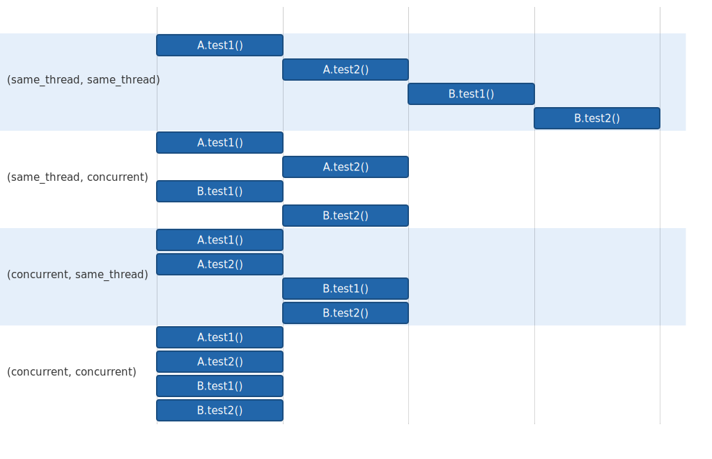

## 병렬 실행 방식 설정
### 병렬 실행 가능하게 설정하기
~~~
junit.jupiter.execution.parallel.enabled = true
~~~
### 기본 실행 방식 변경하기
~~~
junit.jupiter.execution.parallel.mode.default = same_thread
junit.jupiter.execution.parallel.mode.classes.default = concurrent
~~~

### 테스트 코드에서 실행 방식 설정하기
~~~java
@Execution(ExecutionMode.CONCURRENT)
public class ParallelTest1 {
    @BeforeAll
    static void beforeAll() {
        printThread("beforeAll()");
    }
}
~~~

## 동시 병렬 갯수 설정하기
### dynamic
- `junit.jupiter.execution.parallel.config.strategy = dynamic`
- 사용 가능한 프로세서/코어 수에 따라 동적으로 변경
- junit.jupiter.execution.parallel.config.dynamic.factor로 조절할 수도 있다.
- junit.jupiter.execution.parallel.config.dynamic.max-pool-size-factor로 최대 스레드 수를 제한할 수 있다.
### fixed
- `junit.jupiter.execution.parallel.config.strategy = fixed`
- 동시 병렬 수를 고정 값을 사용한다. 
- `junit.jupiter.execution.parallel.config.fixed.parallelism=6`으로 고정값을 지정한다.
### custom
- `junit.jupiter.execution.parallel.config.strategy = custom`
- 사용자가 직접 설정 파일을 만든다. ParallelExecutionConfigurationStrategy 구현 클래스를 작성한다.
    ~~~java
    public class MyParallelExecutionConfigurationStrategy implements ParallelExecutionConfigurationStrategy {

    @Override
    public ParallelExecutionConfiguration createConfiguration(ConfigurationParameters configurationParameters) {
        return new ParallelExecutionConfiguration() {

            @Override
            public int getParallelism() {
                return 7;
            }
            .......
      }
    ~~~
- 사용자가 만든 설정파일을 셋팅한다. `junit.jupiter.execution.parallel.config.custom.class=sample.junit5.MyParallelExecutionConfigurationStrategy`

## 베타적 제어 @ResourceLock
- 공유자원에 대해 다중 액세스가 발생해도 문제 없이 동작할 수 있도록 Lock을 건다.
- `@ResourceLock("value")`  
    - value에는 배타적 제어하기 위한 키가 되는 문자열을 지정한다. 동일한 키 문자열이 설정된 @ResourceLock에 대해서만 동기화가 발생한다.
    - AccessMode를 지정할 수 있다.
        - READ, READ_WRITE
        - READ만 있다면 병렬 실행 가능하지만, READ_WRITE가 있다면 배타적 제어된다.
- ~~~java
  public class ExclusiveControlTest {
    static int n = 0;

    @Test
    @ResourceLock("lock")
    void test1() throws Exception { ... }
  }
  ~~~

참고  
- https://www.devkuma.com/docs/junit5/parallel/#google_vignette
- https://junit.org/junit5/docs/current/user-guide/#writing-tests-parallel-execution-synchronization
