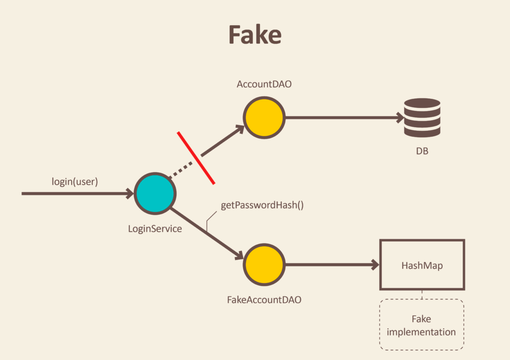
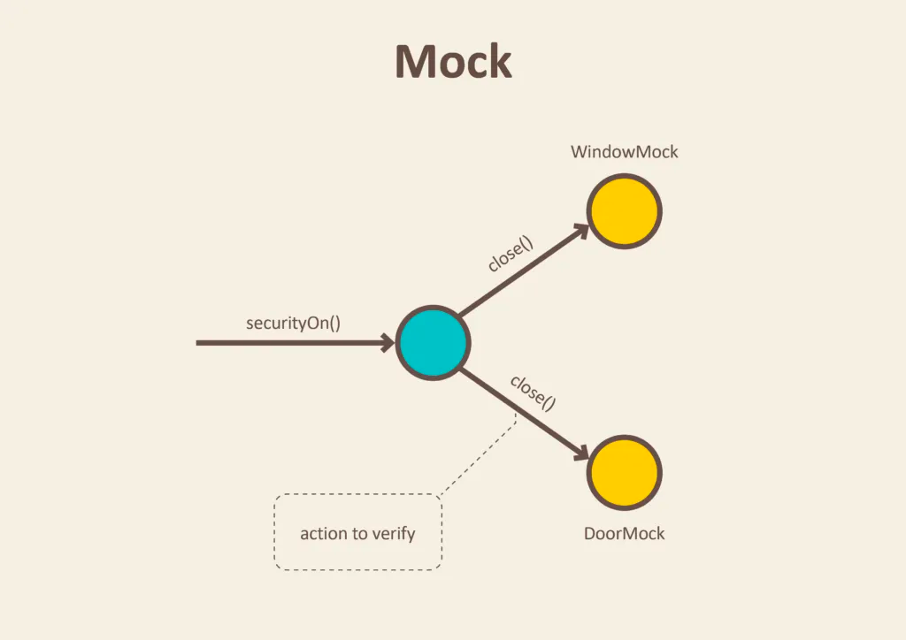
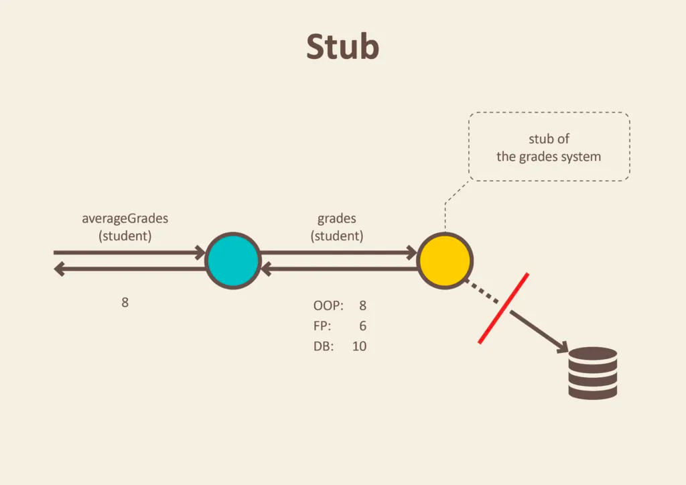

# Fake, Mock, Stub
## Fake

쉽게 말해 가짜 저장소이다. 직접 DB나 외부와 통신하지 않고, 이미 가지고 있거나 입력된 데이터를 이용해 응답을 주는 객체를 말한다. 
~~~java
public class FakeAccountRepository implements AccountRepository {
       
       Map<User, Account> accounts = new HashMap<>();
       
       public FakeAccountRepository() {
              this.accounts.put(new User("john@bmail.com"), new UserAccount());
              this.accounts.put(new User("boby@bmail.com"), new AdminAccount());
       }
       
       String getPasswordHash(User user) {
              return accounts.get(user).getPasswordHash();
       }
}
~~~
## Mock

기능이 호출됐는지 검증하는데 집중한 가짜 객체를 말한다. 
~~~java
public class SecurityCentralTest {
    Window windowMock = mock(Window.class);
    Door doorMock = mock(Door.class);

    @Test
    public void enabling_security_locks_windows_and_doors() {
        SecurityCentral securityCentral = new SecurityCentral(windowMock, doorMock);
        securityCentral.securityOn();
        verify(doorMock).close();
        verify(windowMock).close();
    }
}
~~~
## Stub

이미 정의된 데이터나, 값으로 바꿔치는 것을 말한다. 
~~~java
public class GradesServiceTest {
    private Student student;
    private Gradebook gradebook;

    @Before
    public void setUp() throws Exception {
        gradebook = mock(Gradebook.class);
        student = new Student();
    }

    @Test
    public void calculates_grades_average_for_student() {
        when(gradebook.gradesFor(student)).thenReturn(grades(8, 6, 10)); //stubbing gradebook
        double averageGrades = new GradesService(gradebook).averageGrades(student);
        assertThat(averageGrades).isEqualTo(8.0);
    }
}
~~~
참고자료 : https://blog.pragmatists.com/test-doubles-fakes-mocks-and-stubs-1a7491dfa3da
# Mockito Mock
mock은 가짜 객체로 외부에서 응답을 정해주는데, 내부의 실제 기능은 실행하지 않는다. (stubbing)
그리고 어떤 메소드를 몇번 호출했는지도 검증할 수 있다. (mocking)

## Mockito.mock()
Mockito.mock()은 mock 객체(클래스나 인터페이스)를 만들어준다.
mock 객체의 메소드를 호출하기 전 stubbing(반환 값을 지정)해줘야 한다. (기존 로직을 실행하지 않는다.)
stubbing을 해주지 않으면 원시값은 default를, 구조체는 null을 반환한다.(오류남)
~~~java
@Test
public void givenCountMethodMocked_WhenCountInvoked_ThenMockedValueReturned() {
    UserRepository localMockRepository = Mockito.mock(UserRepository.class);
    Mockito.when(localMockRepository.count()).thenReturn(111L);

    long userCount = localMockRepository.count();

    Assert.assertEquals(111L, userCount);
    Mockito.verify(localMockRepository).count();
}
~~~

## @Mock 
Mockito.mock() 대신에 @Mock 애노테이션으로 간단하게 mock 객체를 만들 수 있다. 
~~~java
@RunWith(MockitoJUnitRunner.class)
public class MockAnnotationUnitTest {
    
    @Mock
    UserRepository mockRepository;
    
    @Test
    public void givenCountMethodMocked_WhenCountInvoked_ThenMockValueReturned() {
        Mockito.when(mockRepository.count()).thenReturn(123L);

        long userCount = mockRepository.count();

        Assert.assertEquals(123L, userCount);
        Mockito.verify(mockRepository).count();
    }
}
~~~
## @Spy
@Mock과 같이 Mock 객체를 만들어주는데, stubbing하지 않으면 기존 로직을 실행한다.   
~~~java
@Spy
List<String> spiedList = new ArrayList<String>();

@Test
public void whenUseSpyAnnotation_thenSpyIsInjectedCorrectly() {
    spiedList.add("one");
    spiedList.add("two");

    Mockito.verify(spiedList).add("one");
    Mockito.verify(spiedList).add("two");

    assertEquals(2, spiedList.size());

    Mockito.doReturn(100).when(spiedList).size();
    assertEquals(100, spiedList.size());
}
~~~
참고문서 : [https://velog.io/@kyukyu/Mockito-프레임-워크](https://velog.io/@kyukyu/Mockito-%ED%94%84%EB%A0%88%EC%9E%84-%EC%9B%8C%ED%81%AC)

